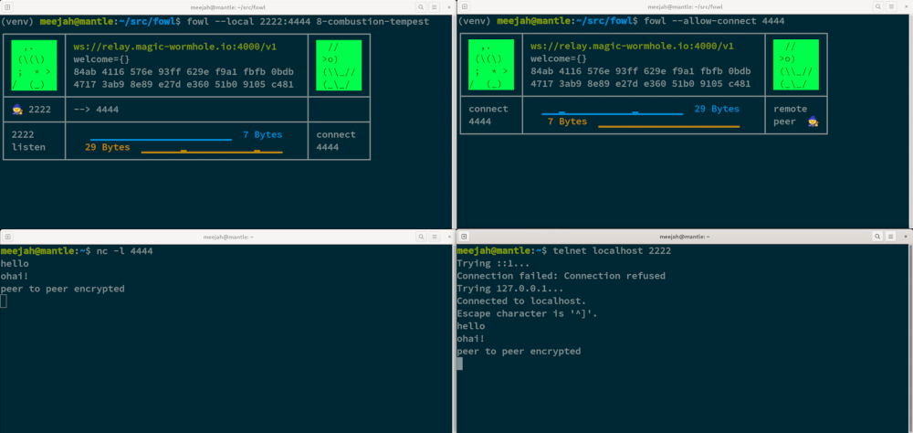

Forward over Wormhole, Locally (fowl)
=====================================

.. image:: logo.svg
    :width: 42%
    :align: right
    :alt: Fowl Logo: a chicken head with two blue ethernet cables

Get TCP streams from one computer to another, safely.

(The base protocol below `Magic Wormhole <https://github.com/magic-wormhole/magic-wormhole>`_ provides a powerful account-less, peer-to-peer networking solution -- ``fowl`` helps you use this power immediately with existing programs)

🤔 Motivation
-------------

We sometimes pair-program but don't like the idea of sending keystrokes over a third-party server.
That could be solved by self-hosting, but we also like avoiding the extra work of "set up a server on a public IP address".

For more context, see my blog posts: `Forwarding Streams over Magic Wormhole <https://meejah.ca/blog/fow-wormhole-forward>`_ and `Wizard Gardens vision <https://meejah.ca/blog/wizard-gardens-vision>`_.

To generalize this a little: there are many FOSS client/server programs that _can_ be self-hosted -- ``fowl`` lets us use these sorts of programs in a peer-to-peer fashion, behind NATs.
This means only depending on one general-purpose, public-IP-having server (the Magic Wormhole "mailbox server" used to set up connections) instead of "one per application" (or more).

🦃 What?
--------

The command-line tool ``fowl`` allows you use any client/server program over `Magic Wormhole <https://github.com/magic-wormhole/magic-wormhole>`_.
Magic Wormhole provides a *persistent*, strongly-encrypted session (end-to-end) with no need for pre-shared keys.

Conceptually, this is somewhat similar to combining ``ssh -R`` and ``ssh -L``.
``fowl`` may be used to set up complex workflows directly between participants, integrating services that would "traditionally" demand a server on a public IP address.

Key features:

* no need to pre-exchange keys
* simple, one-time-use codes that are easy to transcribe
* secure (full-strength keys via SPAKE2)
* end-to-end encryption (and no possibility for unencrypted application data)
* integrate with any tools that can listen on or connect to localhost

This allows an author to write a "glue" program in *any language* that ties together unchanged networked progams.
The communcation channel is:

* set up *without pre-shared secrets*;
* *fully encrypted*;
* and *survives IP address changes or outages*.

All this with *no action required at the application level*, it is just a normal localhost TCP (or UNIX) streaming socket.

✍ Motivational Example
----------------------

When pair-programming using `tty-share <https://tty-share.com/>`_ one handy option is to use the default, public server.
However, *I don't like the idea of sending keystrokes over a third-party server* that I don't run.
(Please note: I have **no** reason to believe this nice person is doing anything nefarious!)

I could fire up such a server myself and use it with my friends...

...but with ``fowl``, one side can run a localhost ``tty-share`` server and the other side can run a ``tty-share`` client that connects to a ``localhost`` endpoint -- data flows over the wormhole connection (only).

**Key advantage**: *no need to expose keystrokes to a third-party server*.

**Additional advantage**: *no need to set up a server on a public IP address*.

🐃 Why is This Particular Yak Being Shorn?
------------------------------------------

I wanted to write a pair-programming application in Haskell, but didn't want to implement Dilation in the Magic Wormhole Haskell library (maybe one day!)

It also occurred to me that other people might like to experiment with Magic Wormhole (and advanced features like Dilation) in languages that lack a Magic Wormhole implementation -- that is, most of them!

So, the first step in "write a Haskell pair-programming utility" became "write and release a Python program" :)

(p.s. the next-higher level Yak is now online at `sr.ht <https://git.sr.ht/~meejah/pear-on>`_ but not "released")

⌨ How Does It Work?
-------------------

``fowl`` uses the "`Dilation <https://magic-wormhole.readthedocs.io/en/latest/api.html#dilation>`_" feature of the `Magic Wormhole <https://github.com/magic-wormhole/magic-wormhole>`_ protocol.

This means that a Magic Wormhole Mailbox server is used to perform a SPAKE2 exchange via a short (but one-time only) pairing code.
For details on the security arguments, please refer to `the Magic Wormhole documentation <https://magic-wormhole.readthedocs.io/>`_.
After this, an E2E-encrypted direct P2P connection (or, in some cases, via a "transit relay" service) is established between the two computers;
that is, between the computer that created the wormhole code, and the one that consumed it.

The key encrypting messages on this connection is only known to the two computers; the Mailbox server cannot see any message contents.
(It, like any attacker, could try a single guess at the wormhole code). See the `Magic Wormhole documentation <https://magic-wormhole.readthedocs.io/en/latest/welcome.html#design>`_ for more details on this.

The "Dilation" feature further extends the above protocol to provide subchannels and "durability" -- this means the overall connection survives network changes, disconnections, etc.
You can change WiFi networks or put one computer to sleep yet remain connected.

What ``fowl`` adds is a way to set up any number of localhost listeners on either end, forwarding data over subchannels.
The always-present "control" subchannel is used to co-ordinate opening and closing such listeners.

With some higher-level co-ordination, ``fowl`` may be used to set up complex workflows between participants, integrating services that would "traditionally" demand a server on a public IP address.

Another way to view this: streaming network services can integrate the Magic Wormhole protocol without having to find, link, and use a magic-wormhole library (along with the implied code-changes) -- all integration is via local streams.
(There *are* implementations in a few languages so you could take that route if you prefer).

👤 Who Should Use This?
-----------------------

We handle and expect two main use-cases of this program: integrators and end-users.

Human CLI users can use ``fowl`` itself to set up and use connections, for any purpose.

For developers doing integration, ``fowld`` provides a simple stdin/out protocol for any runtime to use.
That is, some "glue" code running ``fowld`` as a sub-process.
This co-ordination program will also handle running necessary client-type or server-type networking applications that accomplish some goal useful to users. For example, "pair-programming" (for my case).

Some other ideas to get you started:

- "private" / invite-only streaming (one side runs video source, invited sides see it)
- on-demand tech support or server access (e.g. set up limited-time SSH, VNC, etc)
- ...

💼 Installation and Basic Usage
-------------------------------

``fowl`` and ``fowld`` are Python programs using the `Twisted <https://twisted.org>`_ asynchronous networking library.

You may install them with ``pip``::

    pip install fowl

Once this is done, ``fowl`` and ``fowld`` will appear on your ``PATH``.
Run either for instructions on use.

In accordance with best practices, we recommend using a ``virtualenv`` to install all Python programs.
**Never use ``sudo pip``**.
To create a virtualenv in your checkout of ``fowl``, for example:

.. code-block:: shell

    python -m venv venv
    ./venv/bin/pip install --upgrade pip
    ./venv/bin/pip install fowl
    # or: ./venv/bin/pip install --editable .
    ./venv/bin/fowl

.. _hello-world-chat:

💬 Hello World: Chat!
---------------------

The actual "hello world" of networked applications these days is chat, amirite? 😉

We will use two venerable network utilities (``nc`` and ``telnet``) to implement a **simple, secure, and e2e-encrypted chat**.

Yes, that's correct: we will make secure chat over ``telnet``.
The first insight here is that we can make ``nc`` listen on a localhost-only port, and we can make ``telnet`` connect to a localhost TCP port.

At first we can prove the concept locally, from one terminal to another.
Open two terminals.
In the first, run: ``nc -l localhost 8888``
This tells ``nc`` (aka "net cat") to listen on the localhost TCP port "8888" (it will echo anything that comes in, and send anything you type).

In the second terminal: ``telnet localhost 8888``
This instructs telnet to connect to localhost TCP port 8888 -- that is, the very netcat instance running in the first terminal.
Type "hello world" into either of the terminals, and you should see it appear on the other side.

**Goal achieved!**, partially.
We have "chat" over ``nc`` and ``telnet``.
It's not pretty, but it works fine.

However, we want to talk to other machines.
This means we need:

* encryption;
* and a way to arrange network connectivity

**These additional features are exactly what** ``fowl`` **gives us.**

So, we still run the exact same ``nc`` and ``telnet`` commands, but first do some ``fowl`` magic on each machine.

On the *second* machine (the one running ``telnet``) we'll need to add in something that listens on port 8888.
This thing is: ``fowl --listen 8888 invite``
When connected to the public Mailbox Server, this will print out a ``<secret code>`` like ``1-foo-bar``

Next we want all the information this listener gets to be magically forwarded to the first machine (the one running ``nc``).
So, on it we run: ``fowl --allow-connect 8888 accept <secret code>``.
The ``<secret code>`` comes from the "invite" above, and is communicated -- usually via a human or two -- to the second machine.

Note that we could swap "``invite``" and "``accept``" around if it's more convenient for one or the other human to go first.

What happens under the hood is that the two ``fowl`` programs establish a secure connection, via the public Mailbox Server.
They then use this connection to maintain a persistent (possibly changing) TCP connection between each other (worst case, using the public Transit Relay) to send end-to-end encrypted messages.

``fowl`` uses this connection to communicate via a simple protocol that can establish listeners on either end or ask for fresh connections.
These result in "subchannels" (in the Magic Wormhole Dilation protocol) that can send bytes back or forth.

Any bytes received at either end of the connection are simply forwarded over the subchannel.

Full example, computer one:

.. code-block:: shell

    $ nc -l localhost 8888
    $ fowl --allow-connect 8888 invite
    Invite code: 1-foo-bar

Computer two:

.. code-block:: shell

    $ fowl --listen 8888 accept 1-foo-bar
    $ telnet localhost 8888

**Now we have encrypted chat**.

These two programs can run **anywhere on the Internet**.
Like TCP promises, all bytes are delivered in-order.
In addition, they are **encrypted**.
Also the stream will **survive changing networks** (disconnects, new IP addresses, etc); that is, the actual inter-computer TCP connection is re-stablished, but to the applications (``nc``, ``telnet``) it looks uninterupted.

.. note::

    The two public servers mentioned (the Mailbox Server and the Transit Relay) will learn the IP addresses of who is communicating.
    Tor is supported for users who do not wish to reveal their network location.
    **Neither server can see any plaintext** (like any other attacker, the Mailbox Server could try a single but destructive and noticable guess at the code for any mailbox).

📦 Other Platforms
------------------

We welcome contributions from people experienced with packaging for other installation methods; please get in touch!

🚚 Stability and Releases
-------------------------

This is an early release of, essentially, a proof-of-concept.
While we intend to make it a stable base to put co-ordination software on top, it is not yet there.
APIs may change, options may change.
If you are developing on top of ``fowl``, please get in touch so we know what you need 😊

All releases are on PyPI with versioning following a `CalVer <https://calver.org>`_ variant: ``year.month.number``, like ``23.4.0`` (for the first release in April, 2023).

See ``NEWS.rst`` for specific release information.

🧙 Contributors
---------------

- `meejah <https://meejah.ca>`_: main development
- `shapr <https://www.scannedinavian.com/>`_: much feedback, pairing and feature development
- `balejk <https://github.com/balejk>`_: early feedback, proof-reading, review and testing
