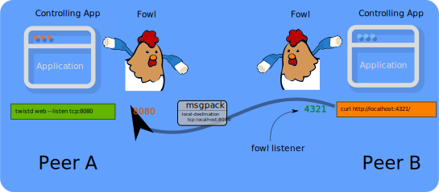

API
===

Lots of "network software" can be considered from a "client / server" perspective, where one side is running a server, and one or more clients connect to it.
For example, the Web: someone runs a Web server and people run clients to fetch information from it.

Often, server software is called "`a daemon <https://en.wikipedia.org/wiki/Daemon_(computing)>`_" for historical reasons.

We consider Fowl from the perspective of "where is the daemon software".
That is, one peer is running the "server-style" software (called "listening").
The other peer runs "client-style" software, and "connects".

Philosophy of the API
---------------------

The basic API attempts to operate on "just enough information" to do its job.
Each peer should learn just enough to do its job (and no more).
This can also be expressed as "the Principal of Least Authority" or PoLA.

(Nevertheless, pragmatic considerations may point towards extensions that reveal more information if that makes understanding or operation "better" along some dimension).

That is: we prefer the least information possible, but may allow additional parameters or APIs that reveal more information than this to expand features, understanding or better use-case coverage.

We also prefer to make the "happy path" or most-general use-cases easy and obvious.

None of the above considerations should compromise security.
For example, if for some reason users "preferred" to use unencrypted connections, we would refuse to enable that use-case.

One immediate consequence of this philosophy is that ports should be picked by the peer that is using them.
That is, if my peer asks the other peer for a listener, they say, "please listen!" -- they do not say, "please listen on port 5555!".
We thus prefer "names" for services and connections -- "connect to your service called 'foo'" or "please add a listener for a service called 'quux'".

Terminology
-----------

Although Fowl operates "peer to peer" (which typically means two computers), it can often be the case that we want more computers involved.
This can naturally lead to considering one of the peers as "a Host" that may invite several other peers as "Guests".

We try to be careful about centering "real humans" as distinct from computers they may control.
Thus, we try to avoid confusing anthropomorphisms like "Alice" and "Bob" -- those are human names, but typically blur the line between "Alice" herself and "a computer Alice controls".

Examples using computers should use computer-relevant names like "laptop", "desktop" or "phone".
Humans get human names -- but an important feature of humans is that they may control multiple computers at once.

Thus, "two peer computers" called "laptop" and "desktop" may be controlled by either one or two humans -- this distinction should *always* be obvious in documentation and specifications.

When talking about "a Host" versus a "a Guest", we mean a computer.
Magic Wormhole connections are always between exactly two computers -- so "a peer" is always one computer, and "a wormhole connection" is always between precisely two computers.

(*Aside:* even this isn't *quite* accurate, as Magic Wormhole is "a computer program" and so we can run it many times on a single computer).

Servers, Clients, Forwarding, Oh My
-----------------------------------

In "peer to peer" software there is often a lot of symmetry .. and "who does what" can become less clear.
This is true of Fowl: either side can set up a forwarding of ports in either direction.

Since Fowl exists to help run "traditional" network-using software between two peers, we have to decide "where the server runs" anyway.
So, it becomes somewhat natural to center discussion of our API around that.

Earlier, we talked about the concept of "a Host".
If your use-case has such a role, this is typically a natural place for the "server-like" software to run.

Consider a screen-sharing use-case: some human has a computer with a screen they'd like to share to others.
This computer (let's call it "desktop") is thus a natural choice to be "the Host".
Then, the user can invite any number of observers -- the Guests.

By running the "server-style" software on the Host's computer "desktop" we can easily accommodate many guests.

Finally, a Diagram of the Situation
-----------------------------------

No matter what combination of APIs are used for setup, *logically* our setup consists of one or more "Fowl services" which each contain one or more listening/connect pairs of forwarded network streams between two peers.

This diagram depicts two peers ("A" and "B") connected via a Magic Wormhole across the internet.
Both sides are using "fowl", and have a single logical "Fowl service" called "blog" here.
This service consists of a single forwarded connection: Peer A runs a "twisted Web" daemon on port 8080, while Peer B runs a Fowl listener on port 4321.

That is, Peer A has a "listen" style socket on port 8080 (in use by the Web server subprocess -- this could be `nginx` if you prefer).
And meantime, Peer B has a "listen" style socket on port 4321, in use by the Fowl Python process.

When the "curl" process on Peer B connects to this Fowl listener on `localhost:4321`, the connection is forwarded across the wormhole, and the Fowl instance on Peer A connects locally to `localhost:8080` -- where the Web server is running.

**This is the magic**: Peer B is connected to Peer A's Web server, with both peers using only "localhost" as the host-name.
Network traffic is streamed across the Magic Wormhole.

Note::
   Experts at Web things may understand that this is one of the cases where we do actually care about ports -- because this particular setup won't work for many Web things.
   We actually need Peer B to *also* listen on port `8080` -- because a "Web Origin" cares about the port too.
   More about this special case below.

If our logical "blog" service also needed, for example, a WebSockets listener we could also lump that together in this single logical Fowl service.
How the application developer groups (or does not) actual forwarded connections is up to them.

So, to recap, we have:

- one "Fowl service" called "blog"
- ...which consists of one forwarded connection, called "web"
- ...using port 8080 on the "host" peer (Peer A), and port 4321 on the "guest" peer (Peer B)

Well-behaved "Fowl service" code will be written so that two or more Fowl services may be composed together over one Wormhole.
For example, we might want to do "git withme" as well as "tty-share" on the same wormhole, to accomplish "peer to peer pair programming"

What About the API?
-------------------

Okay, there are actually several "levels" at which to consider the API:

- `FowlNest`, the closest to the network
- `create_nest()`, still Python but configuration-based (uses the above)
- `fowl` CLI, for use by non-Python programs and scripts

The API: `FowlNest`
-------------------

Continuing the bird theme, the core of the Fowl API closest to the network / Twisted is a `FowlNest`.
Each `FowlNest` instance logically represents a cohesive set of services -- which will consist of at least one forwarded stream.

Each "service" inside a `FowlNest` has a **unique name** and consists of two pieces, one on each peer:
- running **server software** (aka "daemon"), on some localhost port;
- and a **Fowl listener** on some localhost port

We use the words "fledge" and "roost" as opposites to differentiate these two aspects of a service.
So, for a service named `"foo"` one peer calls `fledge("foo")` and the other calls `roost("foo")`.
The peer that calls `fledge()` arranges to run the "server style" software (usually as a subprocess listening on localhost, although a Twisted listener in the same process is also possible)

If you are creating a service that others might wish to compose, having an API that returns a `FowlNest` instance (with all services set up) is recommended.

Fowl runs on top of Magic Wormhole, so it requires a wormhole instance to operate -- we leave the creation of this Wormhole (via `wormhole.create()`) up to the application developer.
We in fact need a `wormhole._DeferredWormhole` instance that has a `dilate()` method.

At some point, it is necessary to call `dilate()` on the wormhole in order to enable Dilation (`dilate()` must be called precisely once).
Each `FowlNest` is kind-of like the "builder" pattern.
So the actual "build" function is the thing that calls `dilate()` and adds services.

This API is ``build_nests()`` and takes any number of ``FowlNest`` instances.
It also takes an ``extra_subprotocols=`` argument to accommodate additional users of this wormhole that are not using Fowl.
That is, other Python + Twisted use-cases for this particular Wormhole instance that are *not* using Fowl.

The ``build_nests()`` call takes care of the ``.dilate()`` call, and so it also accepts any ``kwarg`` that ``dilate()`` accepts.
It ultimately returns the `DilatedWormhole` instance that `.dilate()` itself returns -- after doing the setup necessary to use all of the `FowlNest` instances passed.

The API of ``FowlNest`` itself involves setting up listening ports, and their corresponding connect port on the other peer.
Only a (unique) "name" for each service is *required*.
When not provided explicitly, all ports are randomly selected unused localhost TCP ports.
Sometimes, services (such as Web things) require ports on both sides to be the same -- we thus allow for a "desired port" to be passed.

Let us consider a generic "chat" service using ``nc`` on the "listen" side and ``telnet`` on the "connect" side.
As per above, the symmetry of a peer-to-peer protocol doesn't immediately give any reason to have the "listener" on either of the peers -- it's a pretty arbitrary decision in this scenario.

Given peers "laptop" and "desktop", we could set this up in either of these two ways:
Laptop listens::

    laptop        -> FowlNest(laptop)      ->  FowlNest(desktop)     -> desktop
    (nc -l 1234)     .fledge("chat", 1234)     .roost("chat", 4321)     (telnet localhost 4321)

That is, we have the listener on "laptop" so we call "fledge" on that side.
In this example, we've given explicit ports -- but one may call ``fledge("chat")`` to get a random one instead.
With this particular setup, the Fowl on "laptop" side will "request-listener" from the "desktop" side via a "fowl command".

Another way to set this up is like this::

    laptop                  -> FowlNest(laptop)     -> FowlNest(desktop)     -> desktop
    (telnet localhost 4321)    .roost("chat", 4321)    .fledge("chat", 1234)    (nc -l 1234)

For every Fowl service, there's one side with a "fake" listener (provided by Fowl), and one side with a "real" listener (provided by application code).
This "real" listener could be in Python + Twisted but more commonly it's a subprocess, running like a daemon (as in the above examples).

The side upon which you call ``fledge`` or ``roost`` controls where the "real listener" is -- it is always on the ``fledge`` side.
Regardless, there is only one kind of "fowl command", and that is ``request-listener``.
That means the peer calling ``fledge()`` will initiate the request/response command ``request-listener``.

This means that ``roost()`` merely *prepares* for real work -- **it is lazy**!
We *lazily-instantiate services* in case a particular application only needs them under certain circumstances.

In contrast, ``fledge("X")`` causes real work to happen -- we send a command to the other Peer asking for their side to be set up.
An error will result if that other peer has *not* called ``roost("X")``.

One way to consider this is that ``roost("foo")`` sets up permission; it is preparing a place for a ``fledge("foo")`` to land (but the other peer's service "foo" may never "take off" at all, in which case the "roost" will go unused).
