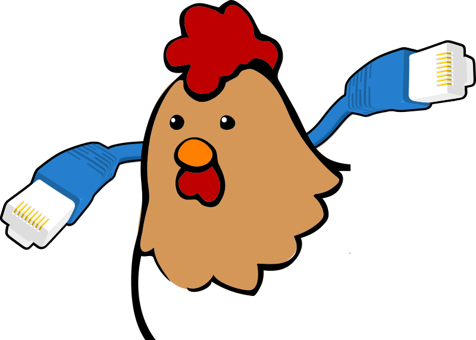

fowl: Forward Over Wormhole, Locally
=======================================

``fowl`` is a tool that utilizes `Magic Wormhole <http://magic-wormhole.io>`_ and its Dilation feature to forward arbitrary streams over an easy-to-setup yet secure connection.
**Peers** communicate to each other over an **end-to-end encrypted** connection, and can use client-type or server-type network services from each side.
Allowed ports and permissions are **whitelist** based.

There are no logins, no identities and the server can't see content because it's end-to-end (E2E) encrypted between exactly two peers.
Additionally, the server is often not involved in the "bulk transport" of bytes at all as the protocol prefers P2P connections.

Conceptually, this is similar to ``ssh -R`` and ``ssh -L``.

Sound interesting? Read on!

.. toctree::
   :maxdepth: 2

   README
   usage
   frontend-protocol
   protocol
