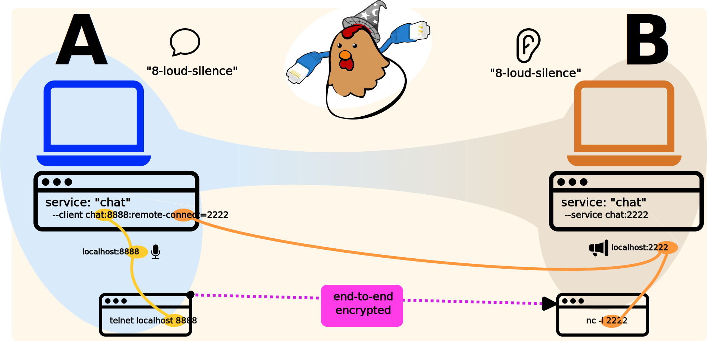

Command-Line Usage
======================

This project actually ships two CLI tools: ``fowld`` and ``fowl``.

``fowld`` versus ``fowl``
-------------------------

One is intended for automated, programmatic use (``fowld``) and the other is intended for human use (``fowl``).

Most users should use ``fowl``.

Programs that integrate with (or otherwise want stable, machine-parsable output) should use ``fowld``.
All functionality is available to users of either program.

If you want very similar operation to ``fowld`` but do not like typing JSON, use ``fowl tui``.

Note that if you're invoking with ``python -m`` then ``python -m fowl`` is "fowld" and ``python -m fowl.cli`` is the human-centric ("fowl") one.

High-Level Overview
-------------------

What we aim to accomplish here is to easily set up the forwarding of TCP streams over a secure, identity-less and durable connection.

These streams may be anything at all -- but the core use-case is aimed at eliminating the need to run public-IP services.
Our canonical "hello world" example is a simple chat system:
- running ``nc`` (aka "netcat") on one side;
- and ``telnet`` on the other (see :ref:`hello-world-chat` for a fully-worked example).

Although ``nc`` and ``telnet`` provide no security, using them here we get an end-to-end-encrypted chat session.
We also get "durability" (if one side loses conenction or changes to a different network, we will eventually resume uninterrupted).
We do not have to change the ``nc`` or ``telnet`` programs at all (they can already connect to and listen upon ``localhost`` -- that's all we need).

The general flow of a session is that one side "starts" it (allocating a secret code), and the second side "joins" it (consuming the secret code).
These codes can be used precisely once: if a bad actor guesses or intercepts the code, your partner will know (because it won't work for them).

You may also gain additional security by using the "verifier" feature, if desired (this ensures that you're 100% definitely communicating with the intended party).
See the `magic-wormhole documentation <https://magic-wormhole.readthedocs.io/en/latest/>`_ for a full security discussion.

Philsophy of Commands
---------------------

The ``fowl`` program accepts human-typed arguments, asks questions that humans are expected to answer and produces messages for humans to read.
Many options are available via normal command-line arguments.

Although we'll still avoid gratuitous compatilibity problems, the output SHOULD NOT be considered machine-parsable and may change from release to release.

By contrast, the commands that ``fowld`` accepts and the messages it outputs MUST all be well-formed JSON lines.
Generally, backwards-compatibility SHOULD be available.

There should be few (ideally no) command-line options for ``fowld``.
Programs integrating with it should be able to use any version of the software (that is, to upgrade seamlessly).

.. note::

   Since this is still in rapid development we don't make any promises
   about backwards compatibility *yet*, but will expect in future to
   have a protocol version that will increment with any breaking
   changes.

``fowl`` Usage
==============

``fowl`` is a friendly, human-centric frontend to start or join a forwarding session.
You may specify streams to forward and rules to accept forwarded streams.

Since the Dilation protocol is fairly symmetric, it usually doesn't matter which side "creates" the code and which side "consumes" it.

For example, whether you started or joined a session, either side can ask the other side to start forwarding a port (``--remote``) or start one on the near side (``--local``).

Overview of a Session
---------------------

Using ``fowl`` involves two computers.
One computer runs ``fowl`` with no code and the other computer runs ``fowl <magic-code>`` with a code provided by some other instance of ``fowl``.

After this, a lot of things are "symmetric" in that either side can listen on a port (or cause the peer to listen on a port) and subsequently forward data over resulting connections.

The "symmetric" parts are described in the next session, following which are things specific to the "accept" or the "invite" side.

This wording can become a little confusing due to the symmetry.
Basically, either peer can set up a listener.
When doing so, you must take care set up permissions on the *other* peer.

Every ``--client`` (or ``--local``) MUST be PAIRED with a corresponding ``--service`` (or ``--remote``) for the very same name.
Thus, if you have a ``--local chat`` on one peer you should expect a corresponding ``--remote chat`` on the other peer.

If you need to care about ports, you can specify these -- if there are disagreements it's an error.
Here a "disagreement" means that one side asks for a different port than the other.

So, in the above we have "Peer B" running a service (in this case ``nc``) while "Peer B" runs a client (in this case ``telnet``).
This could be a human on either side running ``fowl`` or it coul be a "controlling program" of some sort running ``fowld`` in a subprocess.

Since we know "Peer B" is running the service, this means it must run the ``--service`` / ``--remote`` option.
This means that "Peer A" must direct its "fowl" to do a "remote" listener (e.g. with ``--client`` / ``--local chat:8888:remote-connect=2222``) which says a service will exist on the far side on port "2222" and we will present a "fake" listener on this side, on port 8888.
"Peer B" will check its permission (e.g. ``--remote`` / ``--service chat:2222``) before actually listening.
(If "Peer B" had invoked ``--service chat:9999`` then an error occurs -- because "9999" is not the same as "2222")

The "best" way to assign ports is not at all -- let each peer select.
If you need to know the ports beforehand, the next-best way is to let each peer assign only its side of the ports -- that is, in the above example, "Peer A" has no real reason to specify ``:remote-connect=2222`` and can just leave that out.

In this particular case, we don't have a good reason to run ``nc`` on "Peer B", so we could flip things around.
That is, decide to run ``nc`` on Peer A, flip who runs ``--service`` etc etc.

One way to decide which peer makes sense is to consider that "--service" is the one that causes "real work" to occur.
The Fowl with a ``--client`` / ``--local`` option is "lazy" in the sense that this just prepares for a service -- but **if and only if** the other side does a ``--service`` / ``--remote`` will listeners be set up and so forth.

The side running ``--service`` is typically doing some other work, such as running daemon software or setting up listeners some other way.

Common ``fowl`` Options
-----------------------

There are several options to control ``fowl`` behavior.
It does not matter whether (or how many) ``--client`` and/or ``--service`` options either peer has.

Besides those options, there are some additional interesting ones:

* ``--mailbox`` which Mailbox server to contact; this can be a WebSocket URI or the name ``default`` for Brian Warner's canonical server or ``winden`` for the Winden server or ``local`` for a localhost one (typically for testing). Both peers must use the same Mailbox to succesfully communicate.
* ``--code-length`` how many words to use in secret codes (only makes sense when not specifying a code)
* ``--ip-privacy`` use Tor

For developers and bug-reporters, some additional flags can be useful:

* ``--debug filename`` output all magic-wormhole state-machine transitions to ``<filename>``.
* ``--debug-status filename`` dump Fowl status state to ``<filename>``.
* ``--replay filename`` replay a file from ``--debug-status`` through the visualizer.
* ``--debug-messages filename`` dump all fowld-style messages to the given file.

Starting a Session
------------------

One side has to begin first, and this side runs ``fowl`` (possibly with some options).
This uses the Magic Wormhole protocol to allocate a short, one-time code.

This code is used by the "other end" to join this forwarding session with ``fowl <code>``.
By default, we see some basic TUI style status.
When you see a "verifier" string (and green "chicken") it means the peer has connected.

Verifier strings look like this::

    b191 e9d1 fd27 be77 f576 c3e7 f30d 1ff3
    e9d3 840b 7f8e 1ce2 6730 55f4 d1fc bb4f

You may be 100% sure you're talking with the intended computer by comparing these verifier strings.
(If they match, you both have the same ephemeral secret key).
This is optional.
However, confirming them means you can be 100% sure (instead of 99.85% sure or 1 in 65536) nobody has become a MitM.

See below.

Joining a Session
-----------------

One side has to be the "second" user to a session and that person runs this command.
``fowl <code>`` consumes a Wormhole code and must receive it from the human who ran the ``fowl`` command which allocated the code.

Both sides see the same visualization once connected.
See above for details about the Verifier.

After this, we reach the more "symmetric" state of the session: although under the hood one side is randomly "the Follower" and one side is "the Leader" in the Dilation session, at our level either side can request forwards from the other.

Generally ports to forward are specified on the command-line, but in the case of ``fowld`` may be asked for interactively at any time.

``fowld`` Usage
===============

``fowld`` is a command-line tool intended to be run in a terminal session or as a subprocess by a higher-level co-ordination program (e.g. a GUI, or a WAMP client, or ``fowl``).

All interactions (besides CLI options) are via a line-based protocol: each line is a complete JSON object.

Most humans should use ``fowl`` instead.

See :ref:`frontend-protocol` for details on the stdin / stdout protocol that is spoken by ``fowld``.

``fowl --interactive`` Usage
============================

Mostly aimed at developers or advanced usage, this command essentially directly maps the frontend protocol (see :ref:`frontend-protocol`) to interactive commands.

At the ``>>>`` prompt, certain commands are accepted.
These map directly to ``"kind"`` JSON commands from the above-referenced protocol.

That is, you _could_ just run ``fowld`` and type in JSON directly -- but this is a little nicer!

There is also a ``status`` command that shows our current knowledge of listeners and active connections.
For debugging, it can sometimes be useful to use the ``ping`` command.
